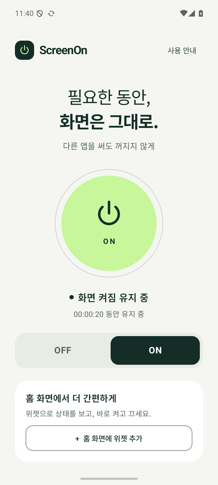
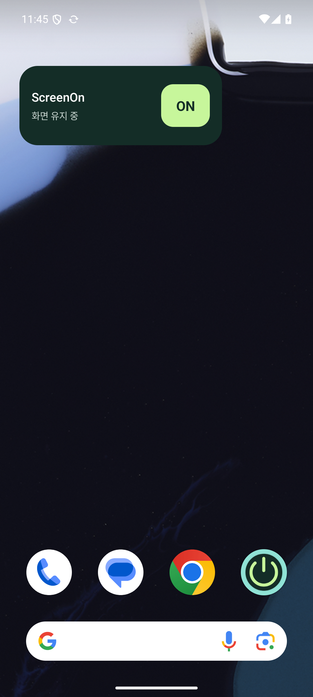

# ScreenOn

**필요한 동안, 화면은 그대로.**

ON인 동안 다른 앱을 사용해도 화면이 꺼지지 않는 작은 Android 네이티브 앱입니다. 광고, 떠다니는 버튼, 가입, 네트워크 통신이 없습니다. 홈 화면 위젯으로 상태를 확인하고 바로 ON/OFF 할 수 있습니다.

| 앱 | 홈 화면 위젯 |
|---|---|
|  |  |

## 설치

[최신 릴리스에서 ScreenOn APK 다운로드](https://github.com/dkdannyboy/screenon/releases/latest). Android 8.0 이상에서 다운로드한 APK를 열고 설치하세요. 기기에서 요청할 경우 다운로드에 사용한 브라우저/파일 앱의 APK 설치를 허용해야 합니다. 저장소가 비공개이므로 GitHub 접근 권한이 있는 계정이 필요합니다.

## 사용

1. 앱에서 **ON**을 누르세요. 다른 앱으로 이동해도 화면이 유지됩니다.
2. **홈 화면에 위젯 추가**를 누르면 런처의 추가 확인 화면이 열립니다. 지원하지 않는 런처에서는 홈 화면을 길게 누른 뒤 위젯 → ScreenOn을 선택하세요.
3. 위젯의 **ON/OFF**는 상태를 바꾸고, **ScreenOn** 이름은 앱을 엽니다.
4. 앱·위젯·알림의 **끄기**로 종료하세요. 전원 버튼으로 잠가도 자동 OFF 됩니다.

Android가 요구하는 조용한 실행 알림은 표시됩니다. 팝업이나 다른 앱 위의 버튼은 표시하지 않습니다. 알림 권한을 거부해도 화면 유지 기능은 사용할 수 있습니다. 재부팅·강제 종료 후에는 자동으로 켜지지 않습니다.

## 개발

- Kotlin / Jetpack Compose / Material 3
- minSdk 26, targetSdk 36, JDK 17
- Gradle wrapper 및 배포판 SHA-256 고정
- 인터넷·오버레이·접근성·시스템 설정 변경 권한 없음

```sh
# Android SDK 설치 후 local.properties에 sdk.dir 지정, 또는 ANDROID_HOME 설정
./gradlew assembleDebug lintDebug

# Android 에뮬레이터 또는 테스트용 기기 연결
./gradlew connectedDebugAndroidTest

# 처음 한 번만 로컬 서명키 생성
python3 scripts/create-signing-key.py
./gradlew assembleRelease
```

서명된 APK: `app/build/outputs/apk/release/app-release.apk`.

`.signing/`은 Git에서 제외됩니다. 이 폴더를 안전하게 별도 보관해야 동일한 서명으로 후속 업데이트를 배포할 수 있습니다. 키가 없는 환경의 릴리스 빌드는 unsigned이며, CI는 디버그·릴리스·기기 테스트 APK 빌드와 lint 검증을 수행합니다. 설치 파일은 GitHub 릴리스에서 제공합니다.

## 동작 범위와 검증

화면 유지에는 공개 API인 `SCREEN_BRIGHT_WAKE_LOCK`을 사용합니다. 이 API는 deprecated이지만, 권장 Activity 플래그는 다른 앱으로 이동하면 유지되지 않기 때문에 요구사항에 맞춰 선택했습니다. 제조사 절전 정책과 회사 관리 기기 정책에 따라 동작이 제한될 수 있습니다.

- [구현과 Android 제약](docs/ARCHITECTURE.md)
- [디자인 결정](docs/DESIGN.md)
- [실행 검증 기록](docs/VERIFICATION.md)

Google Play 등록은 수행하지 않았습니다. 직접 설치 가능한 서명 APK를 제공합니다.
