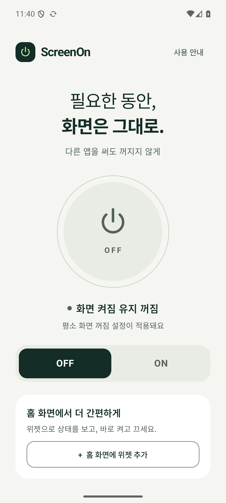
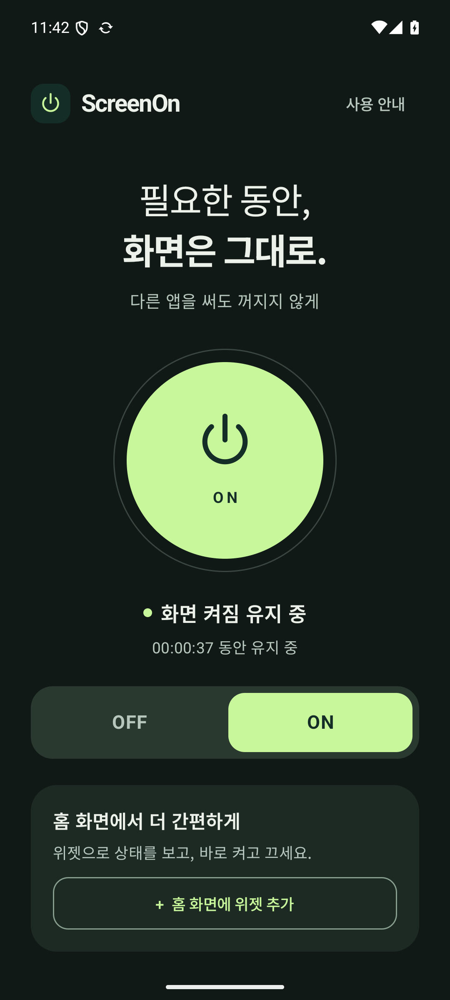

# Verification — 1.0.0

Verified locally on 2026-09-30. Build host: macOS arm64, JDK 17. Device: Pixel 8 Android 15/API 35 arm64 emulator. No physical device was connected; OEM-specific behavior and other Android OS releases remain unverified.

## Automated device tests

`./gradlew connectedDebugAndroidTest`: **6 passed, 0 failed**.

1. ON, open Android Settings, wait 22 seconds with system timeout at 15 seconds: screen stays interactive and one active display lock is present. OFF removes it; after another 22 seconds the display sleeps. Screen timeout remains 15000 throughout.
2. Power button turns the display off, clears state and lock; waking the device does not turn ON again.
3. Five repeated ON requests preserve start time and hold one lock. Repeated OFF is safe.
4. Real Compose power control toggles visible state both ways.
5. Notification OFF action stops the session and releases the lock.
6. Manifest contains no overlay, system-settings-write or internet permission.

Test assertions inspect the current `Wake Locks` block rather than Android's historical acquire/release event log. Setup closes any open notification shade. Device settings are restored in test teardown.

## Final signed-release checks

- `assembleRelease` and `lintDebug`: passed; zero lint errors. Warnings include pinned dependency updates, Korean hardcoded labels, newer widget metadata ignored on older OS versions, and the deliberately unbounded user-controlled wake lock.
- `apksigner verify --verbose --print-certs`: passed, APK Signature Scheme v2, RSA 3072.
- Installed the minified signed APK successfully and opened it.
- Denied notification permission at first ON: active display wake lock still acquired.
- Pinned actual launcher widget through the app; final default size is **3 × 1** on Pixel Launcher.
- Widget OFF releases the lock; widget ON acquires it without opening an Activity. Widget label opens the app.
- Killed the OFF app's background process, then started ON from its home widget: succeeded.
- Force-stopped active app and reopened: OFF, no automatic restart.
- Visually inspected light/dark UI, 375dp width with 200% font scale and animation duration scale 0, scroll to lower controls, landscape 1600×900 at 240dpi, and tablet 1600×2560 at 240dpi. These are emulator display overrides, not separate physical devices.
- Static permission inspection and absence of any WindowManager overlay creation support the no-overlay requirement. Only the OS notification / task manager can display execution status outside the app.

## Screenshots

| Light / OFF | Dark / ON | Home widget |
|---|---|---|
|  |  |  |

Additional captures: [light ON](screenshots/light-on.png), [200% text](screenshots/large-text.png), [scrolled large text](screenshots/large-text-scrolled.png), [landscape](screenshots/landscape.png), [tablet](screenshots/tablet.png).

## Release identity

- Application ID: `com.dkdannyboy.screenon`
- Version: `1.0.0` / versionCode `1`
- APK SHA-256: `921d4b23d720e26704b031238a6f1fa016219326aae076dbaabaee34b3292785`
- Signing certificate SHA-256: `870c08870e6cda51c3eb54746de5c7eb76f610b2226067508909e1a81247289d`

The release key/password are excluded from Git. Keep `.signing/` backed up securely. This evidence does not establish Google Play approval or universal compatibility with manufacturer battery policies.

# Verification — 1.1.0 compatibility update

Verified on 2026-10-02 on the same Pixel 8 API 35 emulator. Galaxy Tab S11 Ultra remains physically unverified. The reported full-screen sleep is a real compatibility failure of 1.0.0; the underlying OEM cause is not established without device logs.

- `assembleRelease lintDebug`: passed.
- `connectedDebugAndroidTest`: **11 passed, 0 failed**. The first attempt was blocked by an emulator System UI ANR before each test; rebooting the emulator resolved that environment failure.
- Compatibility fallback independently kept Android Settings interactive for 22 seconds with an original 15-second timeout and **no display wake lock**. Restoring 15 seconds allowed normal sleep.
- Compatibility service restores the original timeout on power-button sleep; repeated ON preserves the original journal.
- An external timeout change stops the session and preserves that external value.
- Missing WRITE_SETTINGS permission leaves OFF and does not change the timeout.
- A recreated guard retains its recovery journal when permission is revoked, then restores after permission is granted again.
- Existing cross-app retention, OFF, power-button, notification action, real Compose toggle and idempotency tests passed. Manifest checks confirm no internet or overlay permission. WRITE_SETTINGS is now intentionally declared.
- Installed signed 1.0.0 and upgraded in place to signed 1.1.0 successfully. Signing certificate SHA-256 remains `870c08870e6cda51c3eb54746de5c7eb76f610b2226067508909e1a81247289d`.
- Manually followed the minified release UI from compatibility explanation to Android's Modify system settings page, granted access and pressed ON. Timeout changed from 60000 to 2147483647.
- Force-stopped that release: long timeout remained, as disclosed. Cold-launched the app: timeout restored to 60000. This is recovery on relaunch, **not immediate cleanup on force-stop**.

Samsung defaults and manufacturer policy behavior still require validation on the user's actual tablet. No overlay, brightness modification, or simulated touch was added. The permission and force-stop caveats appear in the app and README.
